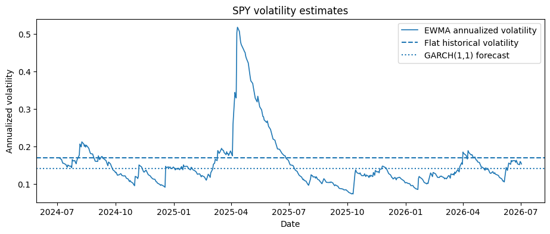
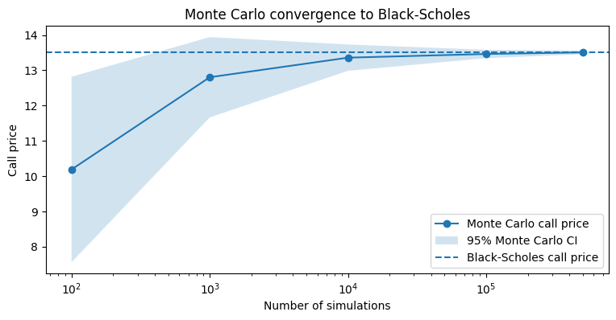
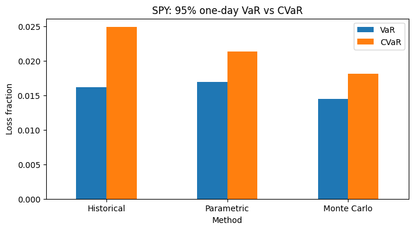

# Options Pricing & Risk Engine

Portfolio project integrating four modules:

- **Black-Scholes** - closed-form pricing of European call/put options.
- **Monte Carlo** - numerical verification of Black-Scholes via GBM simulation.
- **Volatility Modeling** - GARCH/EWMA to feed a better σ into Black-Scholes than flat historical volatility.
- **VaR** - Value at Risk and CVaR / Expected Shortfall (historical, parametric, Monte Carlo).

## Setup

```
pip install -r requirements.txt
```

## Demo

[`notebooks/01_end_to_end_pricing_risk_engine.ipynb`](notebooks/01_end_to_end_pricing_risk_engine.ipynb) runs the full pipeline end-to-end on real market data (SPY): fetches prices, compares flat/EWMA/GARCH volatility, prices an option with Black-Scholes and plots its Greeks, verifies the price with Monte Carlo, and computes VaR/CVaR by all three methods.

**Flat vs EWMA vs GARCH volatility** — EWMA reacts sharply to the April 2025 shock, then decays; flat historical vol never reacts at all:



**Monte Carlo converging to the Black-Scholes price** as the number of simulated paths grows:



**VaR vs CVaR by method** — CVaR exceeds VaR in every method, and the gap is widest for the historical method, which directly captures the fat tail left by the April 2025 shock:



## Status

- [x] Black-Scholes pricing
- [x] Option Greeks (Delta, Gamma, Vega, Theta, Rho)
- [x] Monte Carlo verification
- [x] Volatility modeling (GARCH/EWMA)
- [x] VaR and CVaR (historical, parametric, Monte Carlo)
- [x] End-to-end demo notebook
